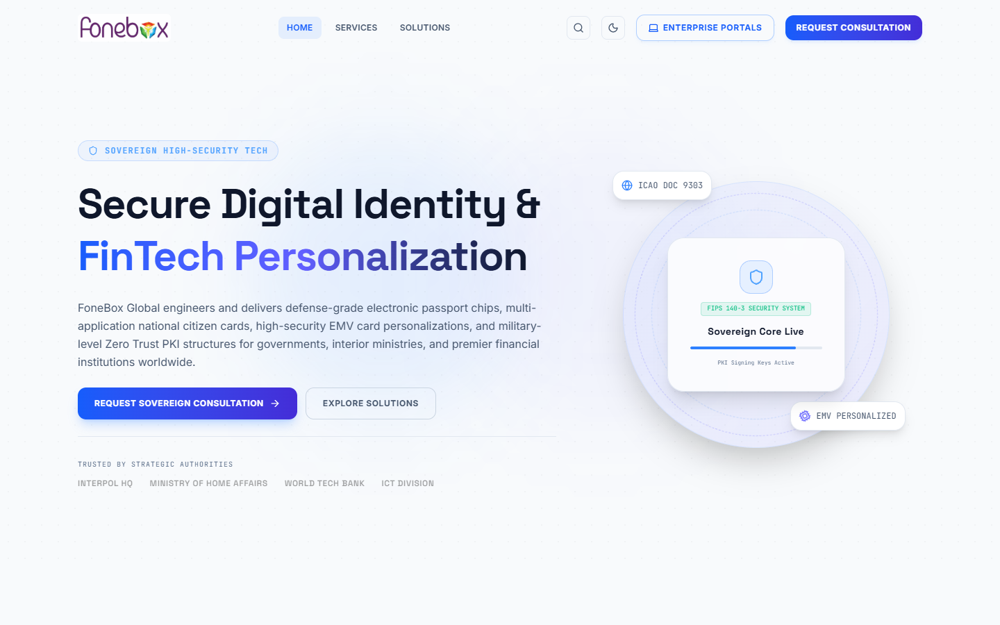
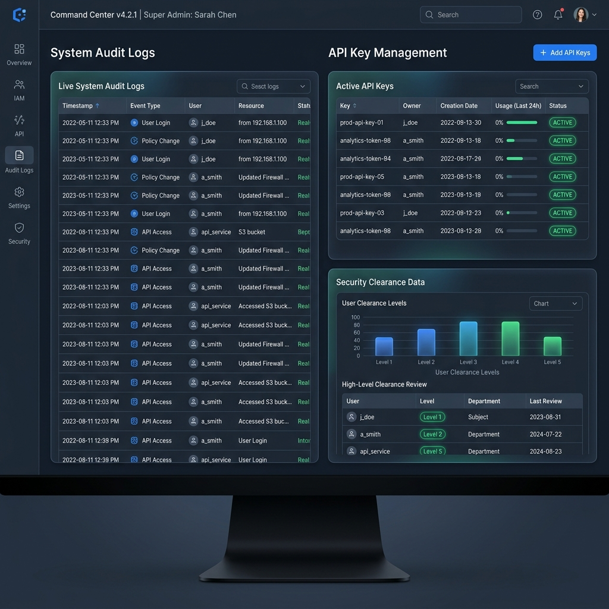
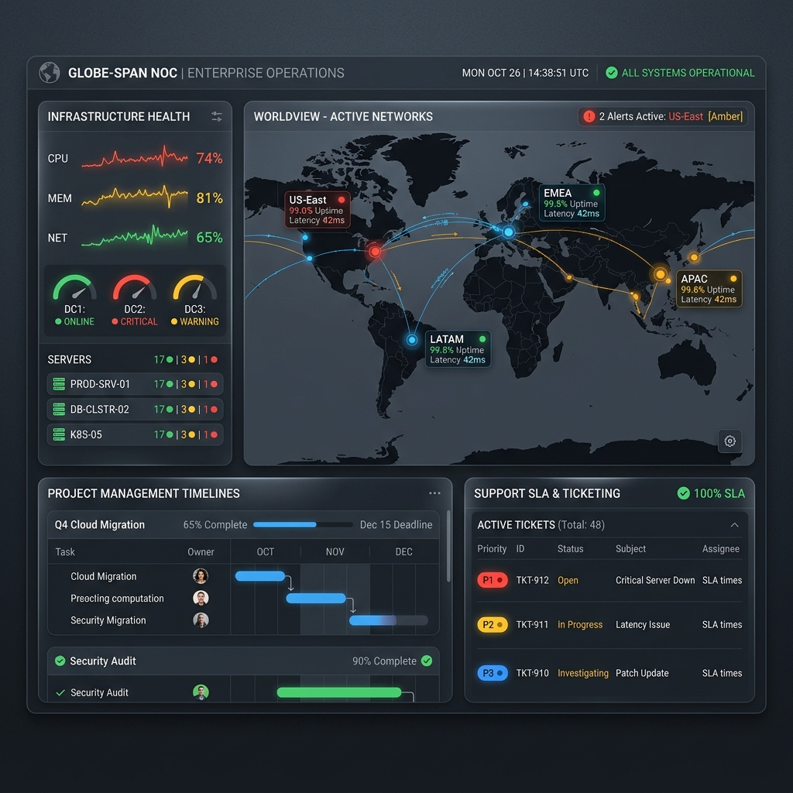
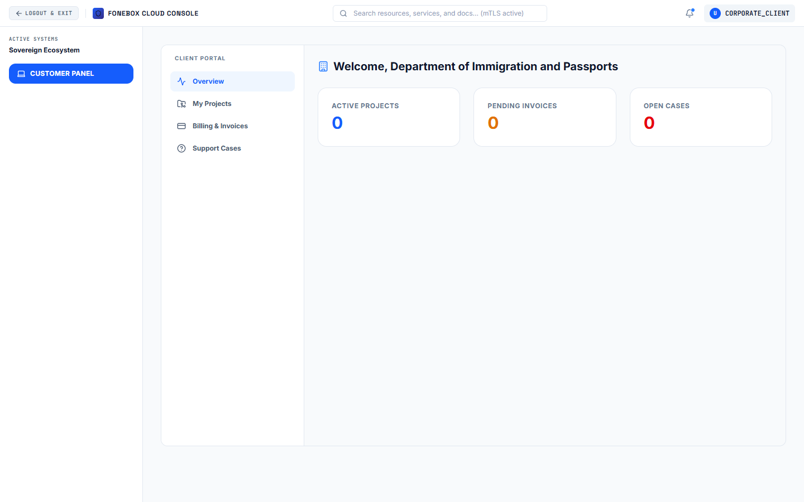

# FoneBox Global Enterprise ICT Solutions Platform

Welcome to the **FoneBox Global Enterprise** platform. This repository contains the source code for our world-class, enterprise-grade, high-security Information and Communication Technology (ICT) platform. 

Engineered from the ground up to support national-level infrastructure, border control operations, and international fintech institutions, this platform serves as both a public-facing corporate portal and a comprehensive internal command center.

---

## 🌟 System Overview & Facilities

The platform is designed with a **Role-Based Access Control (RBAC)** architecture. It offers distinct, highly-secured portals for different user tiers. Below are the facilities and capabilities available through the system:

### 1. Public Corporate Portal

- **Dynamic CMS Pages:** Beautiful, high-performance landing pages detailing Services, Enterprise Solutions, Industries, and Corporate Security protocols.
- **Lead Capture & Consultations:** Secure contact forms and enterprise consultation requests routed directly to the internal CRM.
- **Dark/Light Mode:** Full user-preference support with a sleek, premium UI utilizing Tailwind CSS and Framer Motion.

### 2. Super Admin Command Center (`/admin`)

- **API Key Management:** Dynamically generate, revoke, and monitor high-security API keys for external endpoints.
- **System Audit Logs:** Immutable tracking of all sensitive actions across the platform (logins, CMS edits, security changes).
- **Payment Gateway Configuration:** Safely configure active payment gateways (Stripe, etc.) for client invoicing directly from the UI.
- **Content Management System (CMS):** Edit site-wide branding (logos, favicons), testimonials, enterprise solutions, and system environment variables dynamically.

### 3. CRM Portal (Sales Executives) (`/crm`)

- **Lead & Opportunity Tracking:** Manage the complete sales pipeline from initial contact to closed-won opportunities.
- **Organization Management:** Maintain deep records of national and corporate clients, including their active security clearance levels and key contacts.
- **Consultation Routing:** Respond to consultation requests generated from the public website.

### 4. Operations Portal (Officers) (`/ops`)

- **Project Management:** Track high-stakes enterprise projects, budget utilization, and milestone completion percentages.
- **Meeting Command:** Schedule and manage physical and virtual meetings with stakeholders.
- **Support Helpdesk:** Process and resolve incoming support cases with severity tagging and SLA tracking.

### 5. Client Self-Service Portal (`/client`)

- **Project Tracking:** Corporate clients can log in to securely track their ongoing ICT deployments and milestones.
- **Invoice & Payments:** View outstanding invoices, download them, and process secure payments through integrated gateways.
- **Support Ticketing:** Clients can open direct support cases with the Operations team.

---

## 🛡️ Enterprise-Grade Engineering & Security

To ensure absolute reliability and defense against modern cyber threats, the platform utilizes:
- **Zero-Trust Authentication:** JWTs are issued exclusively via `HttpOnly`, `Secure`, `SameSite=Strict` cookies.
- **High-Performance Caching:** Integrated Redis caching (with seamless in-memory fallback) for sub-millisecond read queries on the CMS.
- **Database Optimization:** PostgreSQL driven by Prisma ORM, utilizing advanced compound indexes for massive scale.
- **Observability:** Includes `/health` probes for Kubernetes/Traefik load balancers and automated Graceful Shutdown handlers (SIGTERM/SIGINT) to protect data integrity during cluster scaling.
- **Optimized Delivery:** Route-level React code-splitting, automated WebP/AVIF image generation, and Brotli API payload compression.

## 🚀 Tech Stack
- **Frontend:** React, TypeScript, Vite, Tailwind CSS, Lucide Icons, Framer Motion
- **Backend:** Node.js, Express.js, Prisma ORM
- **Database:** PostgreSQL
- **Caching:** Redis

---
*Property of FoneBox Global. Unauthorized access to the secure portals is strictly prohibited and logged.*
