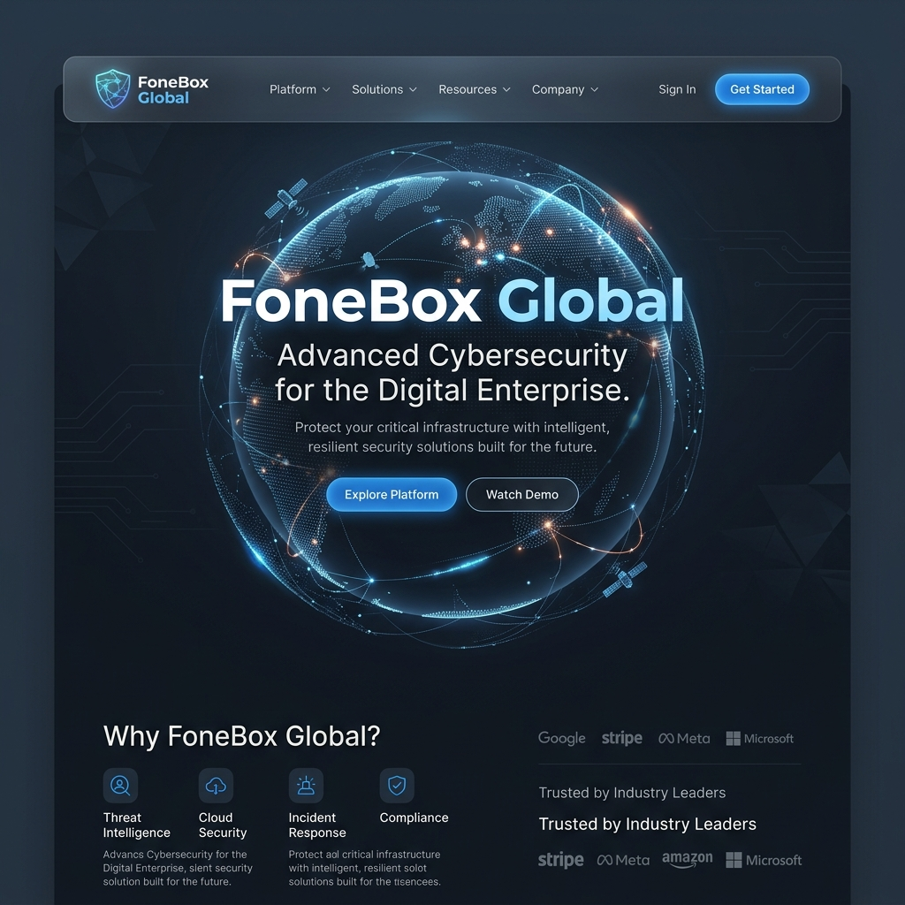
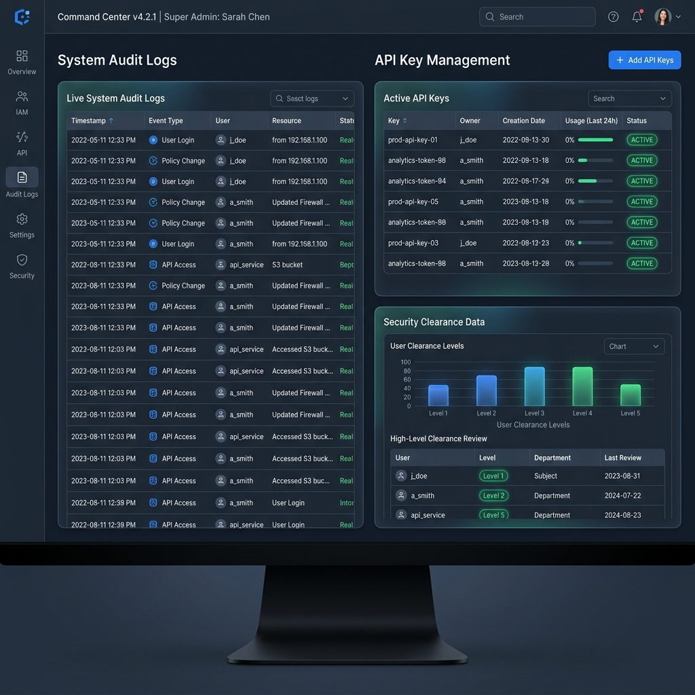
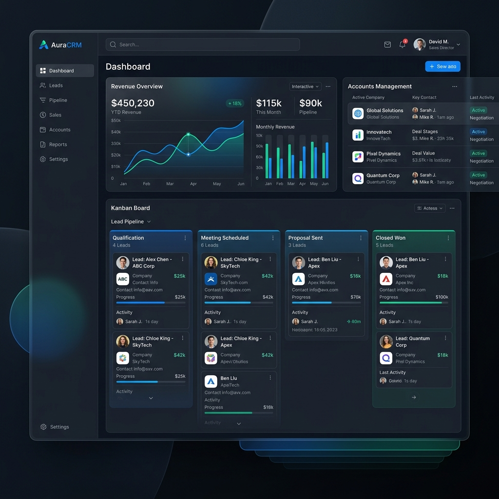

  
  <h1>FoneBox Enterprise ICT Solutions Platform</h1>
  
<strong>A highly secure, state-level cryptographic operations and enterprise management ecosystem.</strong>

---

## 🌟 Total Project Overview

The **FoneBox Enterprise ICT Solutions Platform** is a world-class, enterprise-grade Information and Communication Technology (ICT) platform. Engineered from the ground up to support national-level infrastructure, border control operations, and international fintech institutions, this platform serves as both a high-conversion public corporate portal and a comprehensive internal operations command center.

The architecture strictly adheres to a **Role-Based Access Control (RBAC)** model, offering five distinct, highly-secured portals interconnected via a central PostgreSQL database and an encrypted REST API.

---

## 🚀 Key Benefits & Value Proposition

- **Sovereign Data Security:** Built for defense-grade security, featuring zero-trust authentication, JWT rotation via secure HTTP-only cookies, and bcrypt password hashing to align with FIPS 140-3 protocols.
- **Unified Enterprise Management:** Combines public lead generation (consultations, demo requests, vetting) directly into an internal CRM, removing the need for fragmented 3rd-party tools.
- **Client Transparency:** Empowers corporate clients with a self-service portal to track project milestones, download PDF invoices, and raise end-to-end encrypted support cases.
- **High-Performance Delivery:** Optimized with Vite, React code-splitting, automated WebP/AVIF image generation, and Brotli compression for sub-second load times globally.
- **Seamless Scalability:** Node.js backend configured for PM2 clustering, ready for Traefik load balancing and Kubernetes deployment with `/health` probes.

---

## 📸 System Portals & Facilities

### 1. Public Corporate Portal
The public-facing website acts as the primary acquisition channel, featuring a sleek, hardware-accelerated UI (Framer Motion).
- **Dynamic Content:** Showcasing E-Passports, Secure Bank Cards, and Electronic Visas.
- **Lead Capture:** Fully functional modal workflows for "Request Consultation", "Request Product Demo", and "Security Audit Vetting" routing directly to the internal CRM pipeline.
- **Responsive Design:** Premium mobile-first UX with customized horizontal scrolling for complex datasets.

### 2. Super Admin Command Center (`/admin`)
Absolute root-level control over the entire platform ecosystem.
- **User Provisioning:** Securely manage active personnel, adjust security clearances, and revoke access instantly.
- **System Audit Logs:** Immutable tracking of all sensitive actions across the platform.
- **CMS Management:** Dynamically control public-facing site elements, social links, and security environments.

### 3. CRM & Sales Portal (`/crm`)
Built for Sales Executives to track the complete enterprise lifecycle.
- **Lead Pipeline:** Centralized dashboard to track inbound requests, vetting applications, and demos.
- **Invoice Generation:** Tooling to automatically generate and dispatch professional, cryptographically stamped PDF invoices.
- **Organization Management:** Maintain deep records of national and corporate clients and key stakeholders.

### 4. Operations Command Center (`/ops`)
For SOC Analysts and Operations Officers managing physical and digital infrastructure.
- **Project Tracking:** Monitor high-stakes deployments, budget utilization, and milestone completion.
- **Support Command:** Process and resolve incoming support cases with severity tagging.
- **Threat Intelligence:** Real-time visibility into active nodes and infrastructure health.

### 5. Client Self-Service Portal (`/client`)
- **Infrastructure Tracking:** Corporate clients can log in to securely track ongoing deployments.
- **Invoice Vault:** Secure viewing and downloading of outstanding invoices.
- **End-to-End Ticketing:** Direct communication line to the SOC and Operations teams.

---

## 🛡️ Tech Stack

- **Frontend:** React, TypeScript, Vite, Tailwind CSS, Lucide Icons, Framer Motion
- **Backend:** Node.js, Express.js, TypeScript
- **Database:** PostgreSQL (via Prisma ORM)
- **Deployment:** PM2 Process Manager, Automated Git webhooks, VPS Server Deployment (`fixVPS.ts`)

---
*Property of FoneBox Global Intelligence. Unauthorized access to the secure portals is strictly prohibited and logged.*
