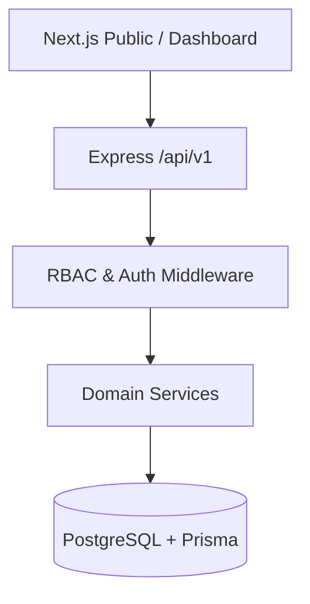

# FoneBox Enterprise CRM

FoneBox Enterprise CRM is a robust, scalable lifecycle management platform designed specifically for hardware repair, SLA tracking, and enterprise device administration. Built as a Turborepo Monorepo, it seamlessly bridges customer-facing lead generation with high-security backend ticketing operations.

## Project Overview

- **Frontend**: Next.js 15 (App Router), React, Tailwind CSS, Zod.
- **Backend**: Node.js, Express, Prisma ORM, PostgreSQL.
- **Architecture**: Monorepo managed via Turborepo, isolating apps from shared configuration packages.
- **Security**: Stateful & Stateless Authentication (JWT + HTTP-Only Cookies), deep Role-Based Access Control (RBAC), atomic database operations, and rigorous Audit Logging.

## Architecture



*For more details, see [docs/SYSTEM_ARCHITECTURE.md](./docs/SYSTEM_ARCHITECTURE.md).*

## Implemented Features

1. **Enterprise Foundation**: Comprehensive monorepo setup, robust error handling, and unified Tailwind design system.
2. **Authentication & RBAC**: Highly secure token architecture with role enforcement across 7 distinct tiers. Complete audit traceability for all login events.
3. **Public Lead Engine**: Data-driven, high-conversion marketing frontend. Forms submit directly into the backend using an atomic sequence generator to ensure perfect `FBX-XXXXXX` references under high concurrency.
4. **AI Generated Assets**: Deep integration with AI asset pipelines for original, production-quality visual assets.

## Folder Structure

```
/apps
  /api          # Express.js REST API
  /web          # Next.js Frontend
/packages
  /config       # Shared Prettier/ESLint configs
  /utils        # Shared utility functions
/prisma         # PostgreSQL Schema & Migrations
/docs           # Architectural documentation
```

## Installation & Development

Ensure you have Node.js and PostgreSQL installed.

```bash
# 1. Install dependencies
npm install

# 2. Setup Environment Variables
# Copy .env.example to .env in /apps/api, /apps/web, and root.
# Ensure DATABASE_URL is set correctly.

# 3. Initialize Database
npm run db:push
npm run db:seed

# 4. Start Development Server
npm run dev
```

## Build

```bash
# Verify integrity across the monorepo
npm run lint
npm run typecheck

# Build for production
npm run build
```

## Roadmap

- ✅ **Prompt 1**: Enterprise Foundation
- ✅ **Prompt 2**: Enterprise Authentication & RBAC
- ✅ **Prompt 3**: Customer-Facing Website & Lead Generation
- 🚧 **Prompt 4**: CRM Pipeline & Operations
- 🚧 **Prompt 5**: Inventory & Parts Management
- 🚧 **Prompt 6**: Customer Portal & Invoicing

*See [docs/ROADMAP.md](./docs/ROADMAP.md) for full details.*

## License

Proprietary Software. All rights reserved.
