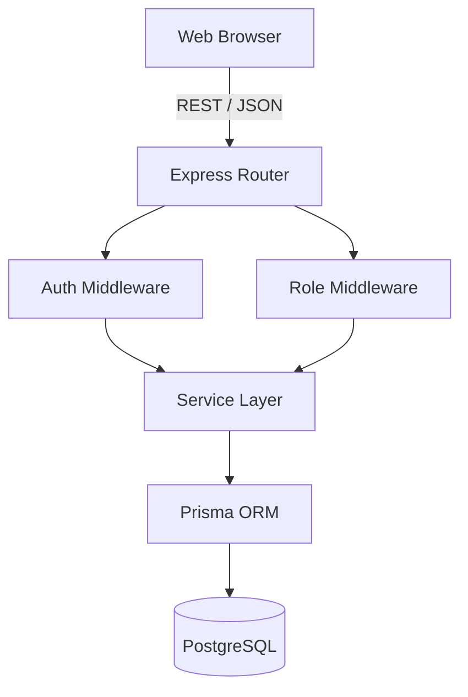
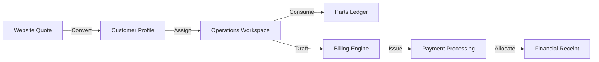
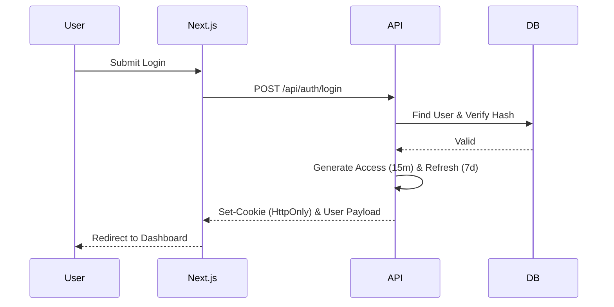

# FoneBox Enterprise CRM: Assessment Mapping & Project Guide

## Assessment Highlights
- **Immutable Financial Engine**: A zero-deletion, append-only historical snapshotting pattern used for Invoices, Receipts, and Allocations.
- **Enterprise RBAC**: Hierarchical, multi-role (ADMIN, CRM_MANAGER, SALES, SUPPORT, ENGINEER) layer securing both API and Next.js frontend pages.
- **Transactional Consistency**: Prisma interactive transactions utilized heavily across domain boundaries (e.g., Inventory Consumption + Invoice Drafting).
- **Business Domain Alignment**: Consumer-style metrics and UI labels replaced with Government ICT & Fintech terminology without breaking schema definitions.

## Project Overview
FoneBox Enterprise CRM is a comprehensive operations and client management platform. The platform handles the entire hardware and identity lifecycle: from initial lead qualification through to project implementation, inventory consumption, and financial billing.

## Technology Stack
- **Frontend**: Next.js 15 (App Router), React 19, Tailwind CSS, Shadcn UI (`lucide-react`, `@dnd-kit/core`).
- **Backend API**: Express.js, TypeScript 5, RESTful architecture.
- **Database & ORM**: PostgreSQL, Prisma Client.
- **Security**: JWT (HttpOnly Access & Refresh Tokens), bcrypt, Express rate-limiting & Helmet.
- **Build & Monorepo**: npm workspaces (`apps/web`, `apps/api`, `packages/config`).

## How To Run
### Prerequisites
- Node.js (v20+)
- PostgreSQL (running locally or via Docker)

### Root-Level Verification Commands
From the monorepo root:
```bash
# Setup dependencies
npm install

# Database preparation
npx prisma generate
npx prisma db push # OR npx prisma migrate deploy

# Run validations
npm run lint --workspace=web
npm run typecheck --workspace=web
npx prisma validate

# Production Build
npm run build --workspace=web
npm run build --workspace=api
```

## Demo Credentials
For testing the deployed application, use the following roles:
- **Administrator**: `admin@fonebox.us` / `Password123!`
- **Sales Rep**: `sales@fonebox.us` / `Password123!`
- **Engineer**: `engineer@fonebox.us` / `Password123!`

---

## Assessment Requirement Matrix

| Assessment Requirement | Implementation | File / Module | Status |
| :--- | :--- | :--- | :--- |
| Customer Facing Website | Next.js Marketing Pages | `apps/web/src/app/(marketing)` | Completed |
| Admin Panel | Next.js Dashboard Layout | `apps/web/src/app/admin` & `dashboard` | Completed |
| CRM | Sales Pipeline, Operations Queue | `apps/web/src/app/crm` | Completed |
| Internal Panel | Role-gated backend UI | `apps/web/src/app/internal` | Completed |
| RBAC | JWT payload & RoleGuards | `apps/web/src/components/auth/RoleGuard` | Completed |
| Authentication | Refresh/Access Tokens, bcrypt | `apps/api/src/controllers/auth.controller.ts` | Completed |
| Lead Management | CRM Sales Kanban Board | `apps/web/src/app/crm/sales` | Completed |
| Customer Management | 360-degree Client Workspace | `apps/web/src/app/crm/customers/[id]` | Completed |
| Project Operations | Service Queue & Assignment | `apps/api/src/services/repair.service.ts` | Completed |
| Inventory | Double-Entry Stock Movement | `apps/api/src/services/inventory.service.ts` | Completed |
| Invoice | Immutable Line Item Snapshots | `apps/api/src/services/invoice.service.ts` | Completed |
| Payments | Receivables & Stripe Intent | `apps/api/src/services/payment.service.ts` | Completed |
| Receipt | Financial Receipt Generation | `apps/api/src/services/payment.service.ts` | Completed |
| Audit Logging | Global Activity Feed via Prisma | `apps/api/src/services/activity.service.ts` | Completed |

---

## Feature Matrix

| Feature | Description | Related Module | Status |
| :--- | :--- | :--- | :--- |
| **Sales Kanban** | Drag-and-drop pipeline tracking leads through Qualification to Contract. | CRM | Completed |
| **Identity Operations** | Tracking lifecycle states of E-Passport and E-Visa deployments. | Projects | Completed |
| **Double-Entry Stock** | Permanent ledger of inventory movements, preventing stock desync. | Inventory | Completed |
| **Immutable Invoicing** | Financial historical state preservation unaffected by live inventory updates. | Finance | Completed |
| **Payment Allocations** | Mapping single payments to multiple outstanding invoices (dual-entry). | Finance | Completed |
| **Global Audit Log** | Tracking all user mutations (`CREATED`, `UPDATED`, `DELETED`) across the system. | System | Completed |

---

## System Architecture

### Overall Architecture


### Business Workflow


### Authentication Flow


## Production Notes
- **Prisma Schema**: The database schema is considered locked for v1.0. No destructive migrations are permitted.
- **Session Revocation**: Refresh tokens are tracked in the database and can be revoked globally by administrators.
- **Financial Immutability**: The system explicitly forbids the modification or deletion of `InvoiceItem`, `PaymentAllocation`, and `PaymentReceipt` records post-finalization.
