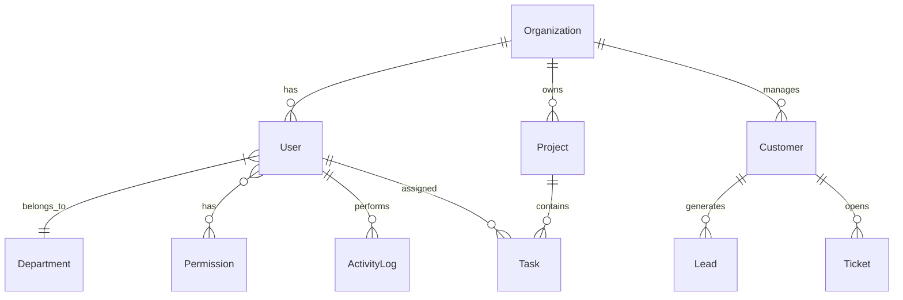

# Database Overview

The FoneBox Enterprise CRM uses PostgreSQL managed via Prisma ORM.

## Schema ERD (Entity Relationship Diagram)

## Core Entities
- **User & Role/Permission:** Manages internal and external access to the system based on predefined enums (ADMIN, CRM_MANAGER, etc.).
- **Organization:** The highest level entity for multi-tenancy or grouping resources.
- **Customer & Lead:** Tracks CRM data.
- **Project & Task:** For internal workforce and deliverable management.
- **Ticket:** Customer support queue mapping to Customers.
- **ActivityLog:** Audit trails for enterprise compliance.
