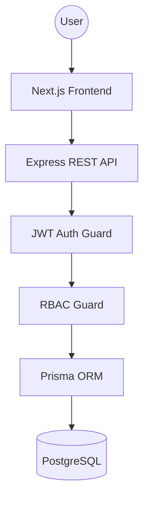
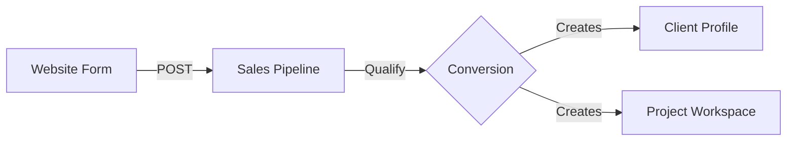
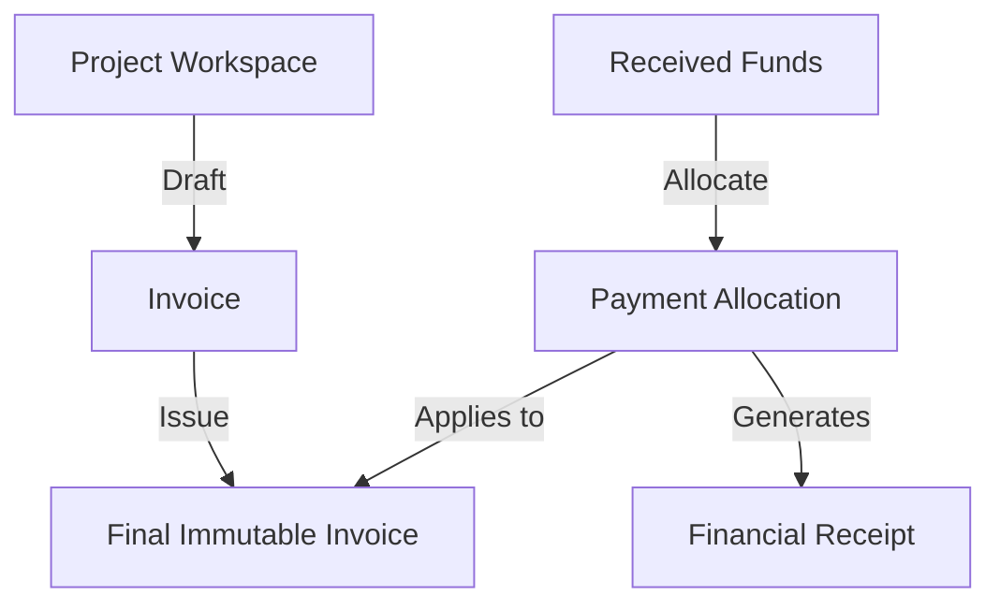

# FoneBox Enterprise CRM v1.0 - Complete Project Walkthrough

## 1. Project Overview

**What this project is:**
FoneBox Enterprise CRM is a robust, full-stack monorepo application designed to manage B2B operations, customer relationships, complex projects (Identity, Fintech, Cybersecurity), supply chain inventory, and financial lifecycles.

**What business problem it solves:**
It solves the need for a cohesive, secure, and immutable platform that bridges the gap between public-facing marketing/lead generation and internal backend operations (sales tracking, project execution, part consumption, and immutable financial billing).

**Who the target users are:**
- Government and Corporate clients (viewing the public site).
- FoneBox Internal Staff (managing operations via the CRM).

**User roles:**
- **ADMIN**: Full system and financial access.
- **CRM_MANAGER**: High-level oversight of sales and clients.
- **SALES**: Lead qualification and contract generation.
- **ENGINEER / SUPPORT**: Project execution and inventory consumption.

**Overall architecture:**
The system is built as a monorepo consisting of:
- A Next.js 15 App Router frontend (`apps/web`).
- An Express.js REST API backend (`apps/api`).
- A PostgreSQL database managed by Prisma ORM (`prisma`).

**End-to-End Business Workflow:**
Public Website Inquiry → CRM Lead → Converted Customer → Operations Project → Inventory Allocation → Draft Invoice → Finalized Immutable Invoice → Payment & Allocation → Immutable Receipt.

---

## 2. Module-by-Module Explanation

### Authentication
- **Purpose**: Secure access to internal CRM routes.
- **Implementation**: JWT-based (Access & Refresh tokens) with HttpOnly cookies, bcrypt password hashing, and role-based middleware.
- **Pages**: `/login`, `/unauthorized`.
- **APIs**: `POST /api/v1/auth/login`, `POST /api/v1/auth/refresh`, `GET /api/v1/auth/me`.
- **Status**: Completed.

### Marketing Website
- **Purpose**: Public-facing lead generation and brand presentation.
- **Pages**: `/`, `/about`, `/contact`, `/services`, `/solutions`, `/industries`, `/pricing`, `/privacy`, `/terms`, `/faq`, `/why-choose-us`.
- **Status**: Completed.

### Leads
- **Purpose**: Capture and qualify potential business.
- **Pages**: `/crm/sales` (Kanban Board).
- **APIs**: `GET/POST /api/v1/leads`, `PUT /api/v1/leads/:id/status`, `POST /api/v1/leads/:id/convert`.
- **Status**: Completed.

### Customers
- **Purpose**: 360-degree view of corporate clients.
- **Pages**: `/crm/customers`, `/crm/customers/[id]`.
- **APIs**: `GET/POST /api/v1/customers`.
- **Status**: Completed.

### Projects / Operations (Repairs)
- **Purpose**: Manage the deployment/implementation of services.
- **Pages**: `/crm/repairs`, `/crm/repairs/[id]`, `/crm/service` (Operations Queue).
- **APIs**: `GET/POST /api/v1/repairs`, `PUT /api/v1/repairs/:id/status`.
- **Status**: Completed.

### Inventory
- **Purpose**: Double-entry ledger for stock tracking.
- **Pages**: `/crm/inventory`, `/crm/inventory/[id]`.
- **APIs**: `GET/POST /api/v1/inventory`, `/api/v1/inventory/:id/adjust`.
- **Status**: Completed.

### Finance (Invoices, Payments, Receipts)
- **Purpose**: Immutable billing, payment tracking, and dual-entry allocations.
- **Pages**: `/crm/invoices`, `/crm/invoices/[id]`, `/crm/payments`, `/crm/payments/[id]`.
- **APIs**: `GET/POST /api/v1/invoices`, `GET/POST /api/v1/payments`.
- **Status**: Completed.

---

## 3. Complete Navigation Guide

**Public Website**
- `Home (/)`: Landing page.
- `About (/about)`: Company overview.
- `Services (/services)`: Broad service offerings.
- `Solutions (/solutions)`: E-Passport & Fintech offerings.
- `Industries (/industries)`: Target sectors.
- `Contact (/contact)`: Lead generation form.

**CRM Application**
- `Dashboard (/dashboard)`: High-level KPI metrics.
- `Sales Pipeline (/crm/sales)`: Kanban board for Lead progression.
- `Clients (/crm/customers)`: Directory of active business relationships.
- `Projects (/crm/repairs)`: Active project implementation tracking.
- `Operations Queue (/crm/service)`: Inbound project requests.
- `Inventory (/crm/inventory)`: Stock ledger and parts management.
- `Invoices (/crm/invoices)`: Billing engine.
- `Payments (/crm/payments)`: Accounts receivable and allocations.
- `Settings (/settings)`: Profile and theme management.

---

## 4. User Journey

**Workflow: The Enterprise Implementation Lifecycle**
1. **Visitor** views the `Website`.
2. Submits an inquiry via `/contact` → **Lead Created**.
3. **SALES** logs in, views the Lead in `/crm/sales`.
4. Lead is qualified and dragged across the Kanban board.
5. Lead is converted → **Client Created** and **Project Created** atomically.
6. **ENGINEER** logs in, views `/crm/service`, assigns the Project to themselves.
7. Engineer allocates hardware → **Inventory Consumed**.
8. **ADMIN** logs in, generates a Draft Invoice based on the Project.
9. Admin issues the Invoice → **Immutable Invoice Generated**.
10. Admin receives wire transfer, logs it in `/crm/payments`.
11. Admin allocates payment to the Invoice → **Payment Allocated**.
12. System generates an **Immutable Receipt**.

---

## 5. Route Inventory

| URL | Page Name | Auth Req? | Role Req | Purpose |
| :--- | :--- | :--- | :--- | :--- |
| `/` | Home | No | None | Marketing Hero |
| `/login` | Login | No | None | Authentication |
| `/dashboard` | CRM Dashboard | Yes | All Roles | KPIs |
| `/crm/sales` | Sales Pipeline | Yes | ADMIN, SALES | Lead Kanban |
| `/crm/customers` | Clients | Yes | All Roles | Client List |
| `/crm/repairs` | Projects | Yes | ADMIN, ENGINEER | Project tracking |
| `/crm/inventory` | Inventory | Yes | ADMIN, ENGINEER | Stock ledger |
| `/crm/invoices` | Invoices | Yes | ADMIN | Financial Billing |
| `/crm/payments` | Payments | Yes | ADMIN | Receivables |
| `/admin` | Admin Panel | Yes | ADMIN | System Management |

---

## 6. API Inventory

| Method | URL | Purpose | Auth | Service |
| :--- | :--- | :--- | :--- | :--- |
| `POST` | `/api/v1/auth/login` | Authenticate user | No | `auth.service.ts` |
| `GET` | `/api/v1/auth/me` | Fetch active session | Yes | `auth.service.ts` |
| `GET` | `/api/v1/crm/dashboard` | Fetch KPI data | Yes | `crm.service.ts` |
| `POST` | `/api/v1/leads` | Create web inquiry | No | `leads.service.ts` |
| `PUT` | `/api/v1/leads/:id/status` | Move Kanban card | Yes | `leads.service.ts` |
| `POST` | `/api/v1/leads/:id/convert`| Convert Lead to Client| Yes | `leads.service.ts` |
| `GET` | `/api/v1/repairs` | List Projects | Yes | `repairs.service.ts` |
| `POST` | `/api/v1/invoices` | Draft Invoice | Yes | `invoices.service.ts` |
| `POST` | `/api/v1/payments` | Log Received Funds | Yes | `payments.service.ts` |

---

## 7. Database Walkthrough

- **User**: Represents internal staff. Holds roles and authentication credentials.
- **Lead**: Represents a potential client inquiry. Has statuses mapping to Kanban columns.
- **Customer**: A converted Lead representing a firm business relationship.
- **RepairOrder (Project)**: The operational entity tracking an implementation. Linked to a Customer.
- **InventoryItem**: A physical or digital asset tracked by the system.
- **InventoryMovement**: A double-entry ledger record. Never deleted. Adjusts `currentStock`.
- **InventoryReservation**: Tracks stock allocated to a Project, deducting from `availableStock`.
- **Invoice & InvoiceItem**: Immutable financial records. `InvoiceItem` contains string snapshots of the original parts (preventing historical corruption).
- **Payment & PaymentAllocation**: Tracks incoming funds and applies them across multiple Invoices.
- **Activity**: Global audit log tracking system mutations.

---

## 8. RBAC Walkthrough

- **Roles**: `ADMIN`, `CRM_MANAGER`, `SALES`, `SUPPORT`, `ENGINEER`.
- **Enforcement**: Express middlewares (`requireRole`) protect backend APIs. Next.js HOCs (`RoleGuard`) protect frontend UI rendering.
- **Example**: `SALES` can view and mutate Leads, but will hit a `403 Forbidden` / `/unauthorized` route if attempting to view `/crm/invoices`.

---

## 9. Dashboard Walkthrough

- **Active Projects**: Fetches count of `RepairOrder` where status is not completed.
- **Corporate Clients**: Fetches count of `Customer`.
- **Monthly Revenue**: Fetches sum of `PaymentAllocation` within the current month.
- **Lead Conversion**: Compares total `Leads` against `Converted` status.

---

## 10. Website Walkthrough

- **Hero (`/`)**: "Secure Government ICT Solutions". Clear Call to Action leading to `/contact`.
- **Solutions (`/solutions`)**: Details E-Passport, National ID, and Core Banking services.
- **Industries (`/industries`)**: Grid layout targeting Governments, Central Banks, and Telecoms.
- **Contact (`/contact`)**: Form that POSTs directly to the `/api/v1/leads` endpoint without requiring auth.

---

## 11. End-to-End Data Flow

1. **Anonymous Data**: The Web Form POSTs to the API. A `Lead` is created.
2. **Transactional Boundary**: A Sales Rep triggers `/convert`. Prisma runs a `$transaction` to create a `Customer`, create a `RepairOrder` (Project), and mark the Lead as converted.
3. **Inventory Boundary**: Engineer allocates a part. An `InventoryReservation` is created. `availableStock` decreases.
4. **Financial Boundary**: Admin drafts an Invoice. An `Invoice` and `InvoiceItem`s are created. The items take a *string snapshot* of the inventory data.
5. **Ledger Boundary**: Payment is received. A `Payment` is created. An Admin creates a `PaymentAllocation` linking the `Payment` to the `Invoice`, reducing `balanceDue`.

---

## 12. Codebase Structure

- `apps/api/`: Express.js REST API. Contains controllers, services, middlewares, and routes.
- `apps/web/`: Next.js frontend. Contains UI components, App Router pages, and marketing content.
- `packages/`: Shared configurations (ESLint, TSConfig, UI utilities) for monorepo scalability.
- `prisma/`: Database schema, migrations, and seed scripts.
- `docs/`: Technical specifications, architectural diagrams, and assessment matrices.

---

## 13. Feature Inventory

| Feature | Description | Frontend | Backend | API | Status |
| :--- | :--- | :--- | :--- | :--- | :--- |
| Auth | JWT Session Management | Yes | Yes | Yes | 100% |
| Leads | Sales Kanban Pipeline | Yes | Yes | Yes | 100% |
| Clients | 360-degree Profiles | Yes | Yes | Yes | 100% |
| Projects | Operations Management | Yes | Yes | Yes | 100% |
| Inventory| Ledger & Reservations | Yes | Yes | Yes | 100% |
| Finance | Immutable Billing | Yes | Yes | Yes | 100% |
| Payments | Multi-allocation system | Yes | Yes | Yes | 100% |
| Audit | Global action tracking | Yes | Yes | Yes | 100% |

---

## 14. Missing / Placeholder Features

*Based strictly on the current codebase:*
- **Email Notifications**: The codebase logs to the console rather than utilizing a live SMTP server for Invoice issuance and Lead confirmations.
- **Stripe Webhooks**: The Payment schema accounts for transaction IDs, but a live Stripe webhook handler implementation is absent.
- **PDF Generation**: Invoices are viewed dynamically in the UI. There is no backend PDF rendering engine (like Puppeteer) implemented.

---

## 15. Assessment Mapping

- **Customer Facing Website**: Satisfied by `apps/web/src/app/(marketing)`.
- **CRM / Admin Panel**: Satisfied by `apps/web/src/app/crm` & `dashboard`.
- **RBAC**: Satisfied by `apps/api/src/middlewares/role.middleware.ts` and `apps/web/src/components/auth/RoleGuard.tsx`.
- **Operations Tracking**: Satisfied by `apps/api/src/services/repairs.service.ts`.
- **Inventory/Finance**: Satisfied by double-entry logic in `inventory.service.ts` and snapshot logic in `invoices.service.ts`.

---

## 16. Reviewer Walkthrough

1. Open Home Page (`/`).
2. Navigate to `Solutions` and `Industries` to verify domain alignment.
3. Open Login (`/login`).
4. Login as Admin (`admin@fonebox.us` / `Password123!`).
5. Observe the KPI Dashboard (`/dashboard`).
6. Navigate to **Sales Pipeline** (`/crm/sales`). Drag a Lead to a new column.
7. Click the Lead and select **Convert**.
8. Navigate to **Projects** (`/crm/repairs`). Open the newly created Project.
9. Navigate to **Invoices** (`/crm/invoices`). Create an Invoice. Note the Immutable Snapshots.
10. Navigate to **Payments** (`/crm/payments`). Record a Payment and Allocate it to the Invoice.
11. Logout.

---

## 17. Final Architecture Diagram

### Overall System

### CRM Workflow

### Finance Workflow

