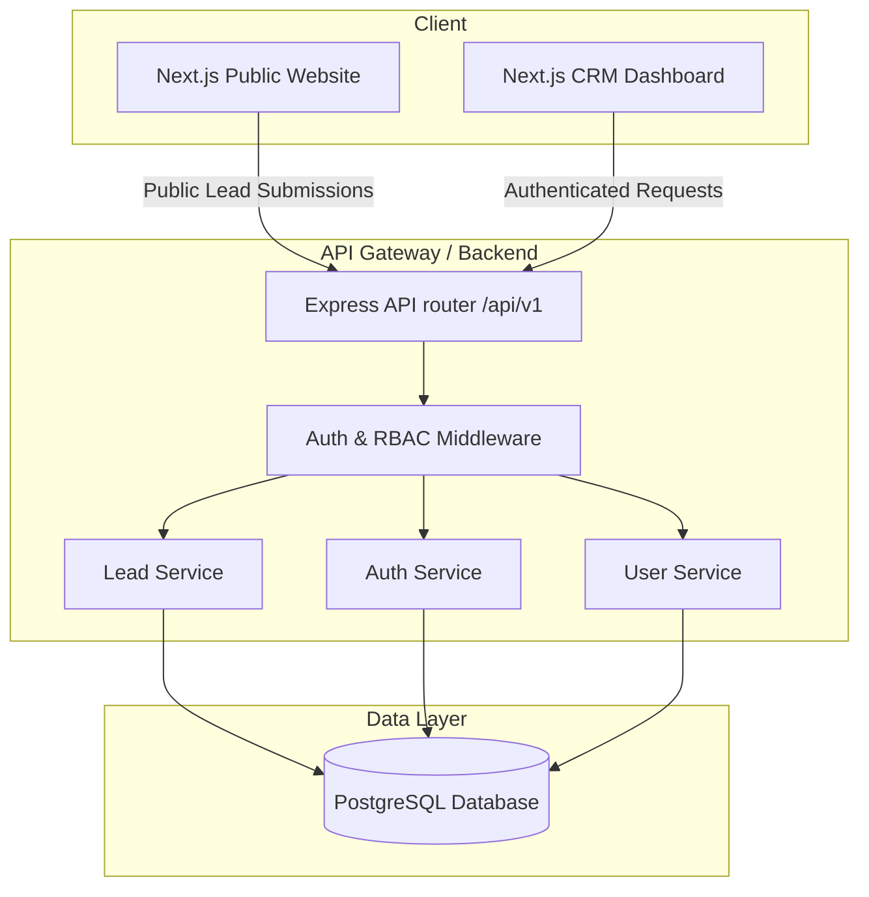
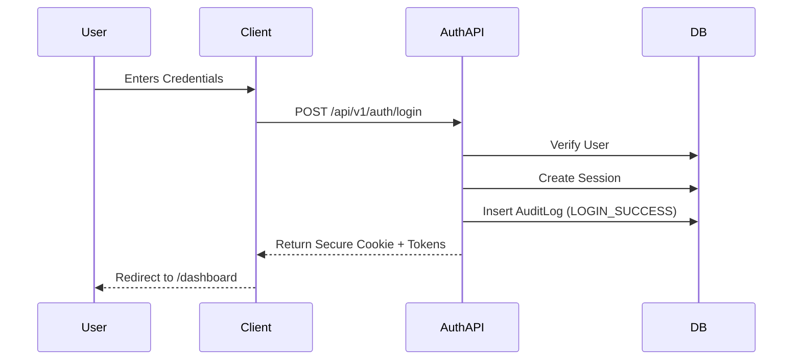
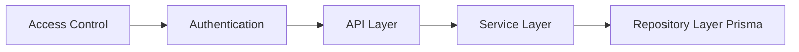
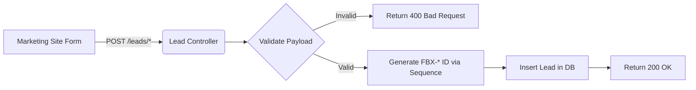

# System Architecture

## Overview
FoneBox Enterprise CRM is a modern, monolithic (logical) yet physically modular platform designed to handle enterprise hardware repair lifecycle management, multi-tiered access control, and customer-facing lead generation. The tech stack is built on a Turborepo monorepo encompassing a Next.js App Router frontend and an Express.js/Prisma backend.

## Architecture Diagram

## Public Website
The public-facing website (`apps/web/src/app/(public)`) acts as the primary lead generation engine. It utilizes Next.js Server Components, static content generation (via `src/content/index.ts`), and localized reusable UI components.

## Authentication Layer
Authentication is stateful and session-based, utilizing secure HTTP-only cookies and robust JWT validation. All authentication actions trigger comprehensive `AuditLog` entries.

## RBAC Layer
The Role-Based Access Control (RBAC) mechanism guarantees absolute data segregation and functional restrictions across different user tiers (`SUPER_ADMIN`, `ADMIN`, `CRM_MANAGER`, `SALES`, `SUPPORT`, `ENGINEER`, `CUSTOMER`). It is enforced both via API middleware (`authorize` hooks) and UI guards (`hasRole`).

## Backend API
The backend is a Node.js Express server (`apps/api`). It follows clean architecture, separating concerns into Controllers, Services, and Repositories (via Prisma). Request schemas are validated strictly using Zod.

## Module Dependencies

## Database
Prisma ORM is utilized for PostgreSQL communication. Core entities include `User`, `Role`, `Session`, `AuditLog`, `Lead`, and `Sequence`. The schema guarantees referential integrity and optimized indexes for fast retrieval.

## Lead Flow
Leads captured from the public website undergo Zod validation, followed by the generation of a guaranteed-unique concurrency-safe identifier (`FBX-2026-XXXXXX`) using an atomic Sequence table upsert.

## Analytics Layer
An abstract `Analytics` class handles event tracking independently of specific third-party providers (e.g., GTM, Mixpanel). It currently tracks `PAGE_VIEW`, `FORM_START`, `FORM_SUBMIT`, etc.

## Future CRM Modules
- **Pipelines**: Ticket routing, repair workflows, SLA tracking.
- **Inventory**: Parts management, supplier integration.
- **Billing**: Invoicing, payment gateway integrations.

## Future Portals
- **Customer Portal**: Self-service ticketing, repair status tracking, history.
- **Admin Panel**: Role management, global configuration, audit reviewing.
- **Internal Portal**: Tech workflows, knowledge base, internal communications.
