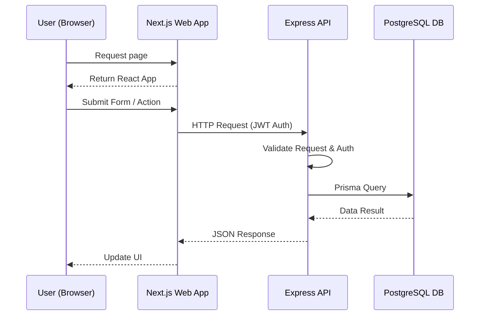
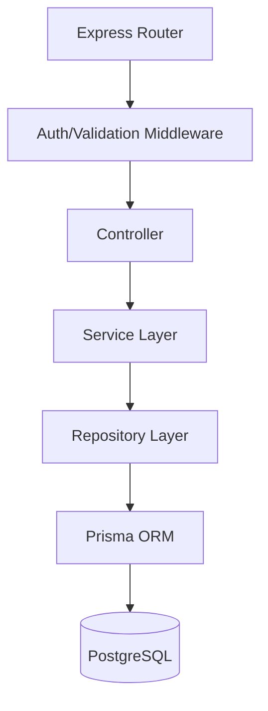

# System Architecture

This document describes the high-level system architecture of the FoneBox Enterprise CRM.

## High-Level Request Flow

## Frontend Architecture
The frontend leverages the Next.js App Router for server-rendered efficiency with rich client-side interactivity where needed.
- **Routing:** Server components by default.
- **State Management:** React Context + Hooks.
- **Data Fetching:** TanStack Query (prepared).
- **Styling:** Tailwind CSS v4 + shadcn/ui.

## Backend Architecture
A layered architecture pattern ensuring separation of concerns.

## Authentication Flow
- JWT based authentication.
- API issues HTTP-Only secure cookies or returns tokens to be stored securely.
- Web app context manages the auth state and hydration across requests.
